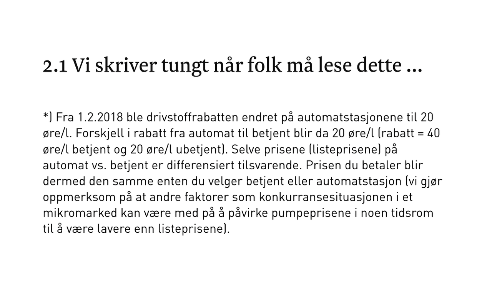
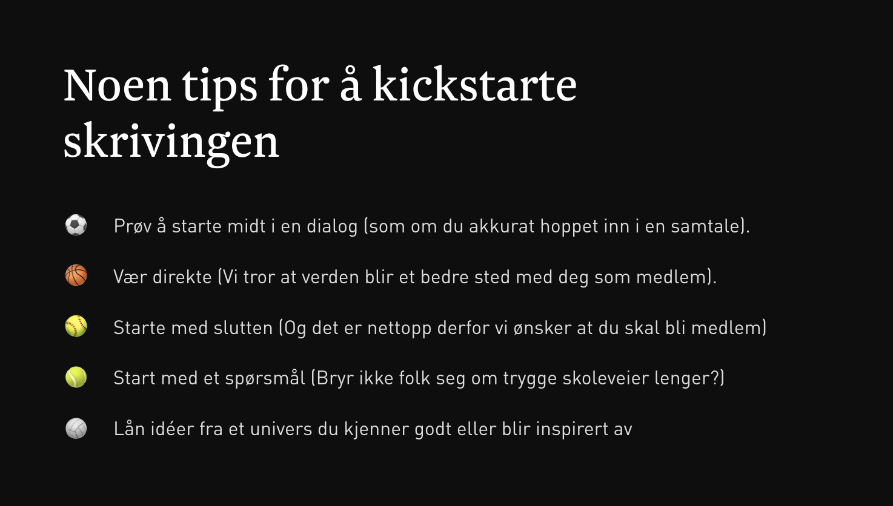
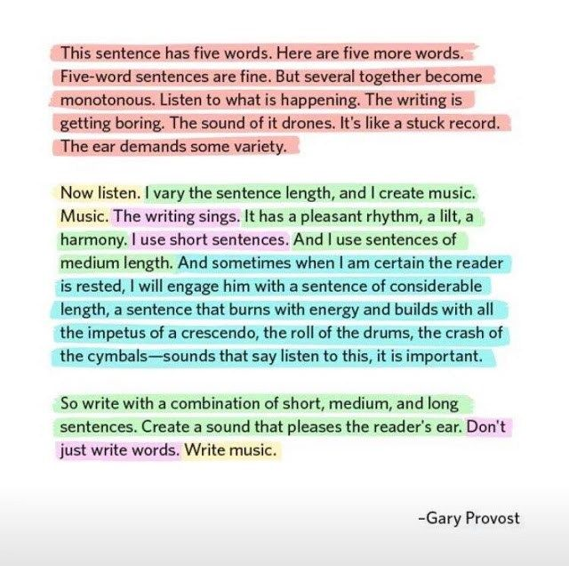

# Finn tyriroten

 Av tekstforfatter Erik Mathisen🚀

Photo by Kelly Sikkema on Unsplash

Med mindre du er en aktiv skogfriskus, eller bare kan veldig mye om trær, så skjønner du kanskje ikke helt hva jeg forsøker å si. Forhåpentligvis leser du likevel videre for å forstå hva tittelen “Finn tyriroten” betyr for deg og ditt fremtidige bidrag til JavaZone.

## Hva er så denne tyriroten?

En tyrirot er i følge Store Norske Leksikon “død furuved som er sterkt gjennomtrengt av harpiks og terpentinstoffer. Den brenner lett og brukes derfor til opptenningsved, peisved og fakler. Tyri er også fra gammelt brukt til utvinning av tjære. Gamle furustubber gir best tyri, men også skadde deler av levende trær, som tørrgrener, kan være bra.”

Så, hvis du er i skogen og trenger noe å fyre opp et bål med, da er tyriroten det aller beste du kan finne. Den brenner godt i regn, snø, sludd og gir blaffen i om det blåser og brenner lenge.

Selv er jeg under middels opptatt av friluftsliv og trær, men langt over gjennomsnittet opptatt av kommunikasjon, og spesielt paralleller og likhetstrekk på kryss og tvers av alt. Ved å lære om nye ting, oppdager jeg fellesnevnere som kan hjelpe meg å si det jeg ønsker å si bedre enn med “vanlige ord”. Det er nettopp derfor språket vårt er fullstappet med sammenligninger og [metaforer](https://snl.no/metafor). Hun “løper som en gaselle” og han “var en løve der han sto og talte til folket”. Vi låner egenskaper fra andre områder for å berike vårt egen kommunikasjon. Akkurat som jeg gjør her med tyriroten.

## Hvordan finne tyriroten

Tenk hvor digg det hadde vært å finne en tyrirot av en tittel? En som brant seg fast i mottakeren bevissthet og nektet å slukke. Som gløder like godt for nybegynnere så vel som veteraner på JavaZone? Det er det vi skal prøve å få til. Nedenfor har jeg samlet noen gode tips til hvordan du kan lage gode titler, og hvordan du kan gi tekstene dine en ekstra piff. 

## Tre tips til å lage gode titler
- Bruk god tid – noen ganger kommer tittelen først, andre ganger til slutt.
- Står du bom fast? Prøv flere ulike tilnærminger (se liste nedenfor med ulike typer titler).
- Tittelen bør gjenspeile noe som føles ekte for deg. En kul tittel hjelper deg lite hvis fremføringen går i en annen tematisk retning. 

## En tittel er ikke bare en tittel

Det finnes mange ulike titler til ulike formål. Her er noen eksempler.

- Informative titler
- Direkte titler
- Indirekte titler
- Problem
- Problem/løsning
- Invitasjon
- Negativ
- Hvordan
- Spørsmål

Og her er et par titler eksemplifisert:

- Direkte titler – Ett år som konsulent
- Indirekte titler – Hvis jeg ble mangemillionær…
- Problem – 8-felts motorvei ut av Oslo for å takle påsketrafikken?
- Hvordan – Slik skriver du kort. Og godt.
- Spørsmål – Hvor ofte går du i dine kunders sko?

## Tre tips til å skrive bedre
- Skriv så folk forstår deg. Innhold presentert i en språkdrakt de fleste forstår, oppfattes oftere som mer troverdig enn avanserte, tekniske forklaringer (derfor er små språklige piruetter som metaforer og sammenligninger viktig). Biologien støtter oss forfattere i dette da hjernen har en naturlig dragning mot alt som er enkelt å forstå, konsumere og gjøre :)

- Skriv levende. Igjen er forskningen på vår side. Mennesker er, på godt og vondt, bedre rigget for å forstå historier fremfor harde, tekniske fakta.
- Skriv troverdig. Litt som vi var inne på i punktet over, tittelen og teksten bør gjenspeile deg som person, ikke bare noe du tror andre liker. Klarer du å begeistre deg selv, er sannsynligheten stor for at også andre blir det.

**Supertips**: Varier språket, men også lengden på setningene dine. Setninger som er like lange vil oppfattes som monotone og kjedelige. Denne teksten illustrerer dette ypperlig:

